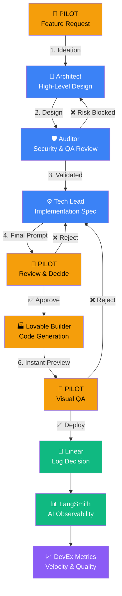

# 🧬 EXOS AI Workflow Constitution

> *"Your procurement exoskeleton"* — The definitive guide to how EXOS is built, maintained, and evolved.

**Version:** 1.0
**Last Updated:** 2026-02-08
**Status:** Active

---

## 1. The Chain-of-Experts Manifesto

EXOS is not built by a single mind. It is forged through a **Chain-of-Experts** — a deliberate, multi-agent workflow where each participant has a clear role, strict boundaries, and defined handoff protocols.

### Core Principles

1. **No single point of failure.** Every decision passes through at least two independent evaluations before execution.
2. **Human-in-the-loop, always.** AI proposes; the Pilot decides. No autonomous deployments.
3. **Velocity without compromise.** Speed is achieved through parallel expertise, not by cutting corners on type safety, security, or quality.
4. **Challenge, don't comply.** Every agent is expected to question instructions that conflict with the project's technical constraints or architectural integrity.
5. **Memory is sacred.** Every decision, rejection, and iteration is logged. Context is never lost.

---

## 2. The Four Pillars

```
┌─────────────────────────────────────────────────┐
│                  THE PILOT (You)                │
│          CEO · Product Owner · Decision Maker   │
│                                                 │
│   "I decide what we build and when we ship."    │
└────────────────────┬────────────────────────────┘
                     │
        ┌────────────┼────────────────┐
        ▼            ▼                ▼
  ┌───────────┐ ┌──────────┐  ┌────────────┐
  │ ARCHITECT │ │ BUILDER  │  │  MEMORY    │
  │  Gemini   │ │ Lovable  │  │  Linear    │
  └───────────┘ └──────────┘  └────────────┘
```

### 🧠 The Architect — Gemini

**Role:** Virtual CTO & Strategy Engine
**Models:** Gemini 2.5 Pro / Flash (via AI Studio)

Gemini operates as a **Virtual Committee** with three sub-roles:

| Sub-Role | Responsibility | Output |
|----------|---------------|--------|
| **Architect** | System design, database schema, API contracts | High-Level Design Document |
| **Auditor** | Security review, RLS policies, risk assessment | Security Sign-off or ❌ Risk Block |
| **Tech Lead** | Implementation specification, Lovable-ready prompts | Final Prompt (ready-to-paste) |

**Rules of Engagement:**
- Architect designs → Auditor validates → Tech Lead specifies
- If the Auditor finds a security risk, the pipeline **halts** (Risk Blocked)
- The Tech Lead produces a prompt that can be pasted directly into Lovable
- All three sub-roles operate in a single Gemini session (Chain-of-Experts protocol)

### 🏭 The Builder — Lovable

**Role:** Senior Full-Stack Engineer & Factory
**Stack:** React + Vite + TypeScript + Tailwind + Lovable Cloud

Lovable is the execution layer. It receives specifications and produces working code.

**Rules of Engagement:**
- Never blindly follow instructions — challenge approaches that conflict with the stack
- Propose 2-3 options for complex implementations before coding
- Prioritize velocity but never compromise type safety
- Keep components small and modular (shadcn/ui philosophy)
- All backend logic runs through Lovable Cloud (edge functions)
- RLS is mandatory for all tables. No exceptions.

### 👤 The Pilot — You

**Role:** CEO, Product Owner, and Final Decision Maker

The Pilot has **two quality gates** in the workflow:

1. **Post-Specification Gate:** Review the Architect's output before it reaches the Builder
   - ✅ Approve → Forward to Lovable
   - ❌ Reject → Return to Tech Lead with feedback

2. **Post-Build Gate:** Review the Builder's output in the live preview
   - ✅ Approve & Deploy → Commit to production
   - ❌ Reject & Iterate → Return with visual/functional feedback

### 💾 The Memory — Linear

**Role:** Institutional Knowledge & Decision Log
**Workspace:** [exosproc](https://linear.app/exosproc/projects/all)

Linear captures everything that matters:

- **Decisions made** (and why)
- **Decisions rejected** (and why)
- **Feature specifications** (linked to implementation)
- **Bug reports** (with reproduction steps)
- **Velocity metrics** (cycle time, throughput)

**Rule:** If it wasn't logged in Linear, it didn't happen.

---

## 3. The Workflow — Step by Step



---

## 4. Observability Layer

### LangSmith Integration

Every AI chain in EXOS is traced via LangSmith:

- **Run Tags:** `scenario_type`, `model`, `pipeline_phase`
- **Metadata:** `processing_time_ms`, `token_usage`, `validation_result`
- **Pattern:** Fire-and-forget with exponential backoff (3 attempts, 100ms base, 2x factor)
- **Rule:** Tracing failures never disrupt the primary pipeline

### DevEx Metrics

| Metric | Source | Purpose |
|--------|--------|---------|
| Cycle Time | Linear | How fast features ship |
| AI Success Rate | LangSmith | % of AI calls that pass validation |
| Rejection Rate | Linear | How often the Pilot rejects outputs |
| Token Efficiency | LangSmith | Cost per analysis |

---

## 5. Technical Constraints

These are non-negotiable. Every agent and human must respect them:

| Constraint | Rule |
|-----------|------|
| **Backend** | Strictly Lovable Cloud. Edge functions for all server logic. |
| **Security** | RLS mandatory on all tables. Never expose PII. |
| **Type Safety** | TypeScript strict mode. No `any` types. |
| **Components** | Small, focused, modular. shadcn/ui philosophy. |
| **AI Config** | Temperature 0.2. Anti-hallucination protocols. Citations required. |
| **Observability** | All AI chains traced in LangSmith with proper tags. |
| **Language** | All UI and documentation in English. |

---

## 6. Onboarding Protocol

When a new AI agent or human contributor joins the project:

1. **Read this document** — It is the constitution.
2. **Review `/docs/ORG_CHART.md`** — Understand the team structure.
3. **Check Linear** — Understand active work and recent decisions.
4. **Respect the gates** — Never bypass the Pilot's approval.
5. **Log everything** — Decisions, rejections, and rationale go to Linear.

---

## 7. The Org Chart

> See [`docs/ORG_CHART.md`](./ORG_CHART.md) for the full AI-first team structure.

**Summary:**

```
                        👤 CEO (You)
                            │
            ┌───────────────┼───────────────┐
            ▼               ▼               ▼
      🛠️ CTO Scope    🧠 Head of AI    🏭 Delivery
      (Engineering)    (R&D & Prompts)  (Execution)
            │               │               │
     Gemini Architect  Gemini Tech Lead  Lovable Coder
     Gemini Auditor    LangSmith        Lovable Builder
     Supabase/Cloud    Prompt Factory   Human QA
```

---

*This document is a living artifact. It evolves as EXOS evolves. All changes must be approved by the Pilot.*
